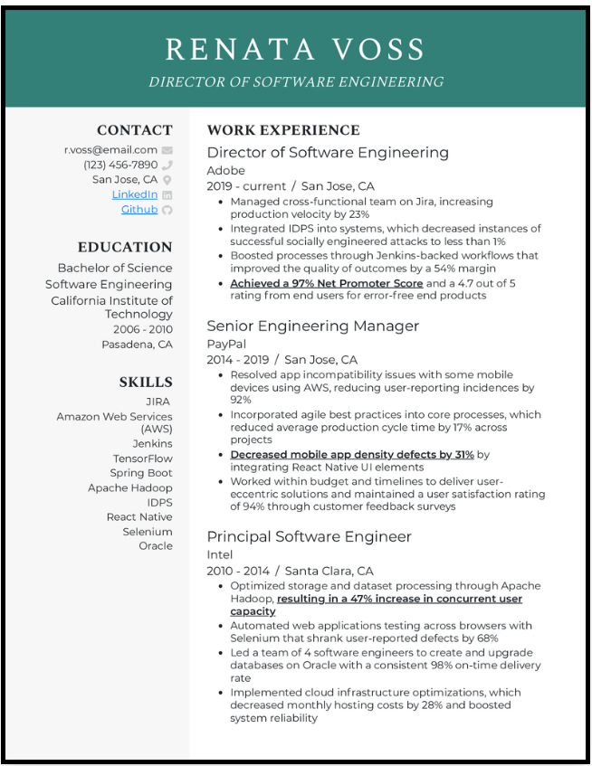
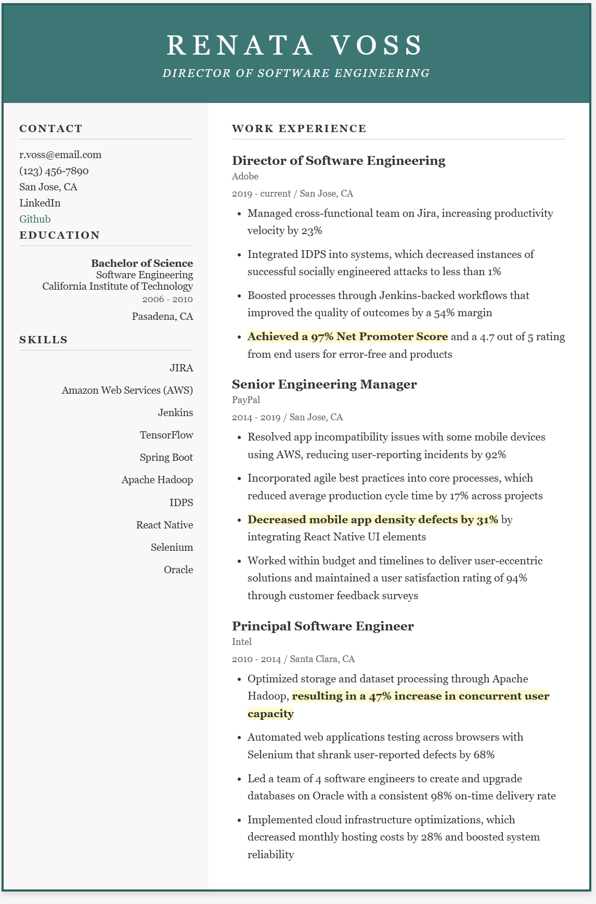

# Frontend Technical Specification

Create a static website that serves an html resume.

## Resume Format Considerations

I live in the United States and resumes in word/pdf are supposed to exclude personal information that can be used to discriminate against you such as age, gender, marital status, etc.

For this purpose I will be using a [custom resume format](https://www.resume-now.com/lp/rnarsmsm126?ref=22299&click_id=wkE3W9Vo7xyNTso2niVMsW8OUkpW4U32UXRl1c0&afsrc=1&utm_source=impact-radius&utm_medium=affiliate&utm_campaign=3814&utm_content=2175146&utm_term=impact-radius&irpid=1955282&mp_value=&sharedid=SL4&data=&jt=).

### Reseme Format Generation

While I can read html, I am not very familiar with generation. I will be using Generative AI to do the heavy lifting for html and possible css generation, from which I will then manually refactor to fit my needs.

Prompt to Agent in Auto Mode:
```text
Convert this resume format into html. Please don't use a css framework. Please use the least amount of CSS tags.
```

Image provided to LLM:


This is the [LLM generated output](./docs/nov-11-2025-gpt5_generated.html) which I will tweak.

This is what the rendered resume looks like unaltered.


## HTML Adjustments

- Because we will be applying mobile styling to the website, we'll include the viewport meta tag so that mobile styling scales normally.
- Well extract our styles into separate stylesheet after we have arrived at a satisfactory level with the markup.
- We'll be using a soft tabs of two spaces for the html page.